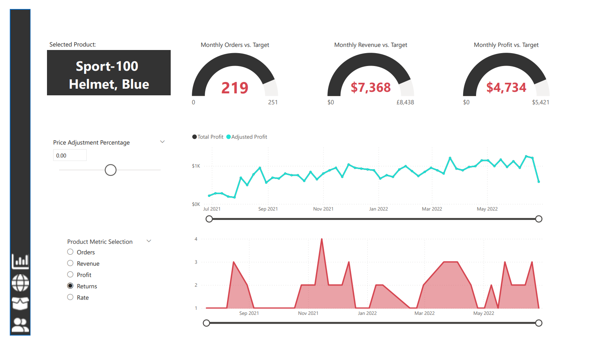
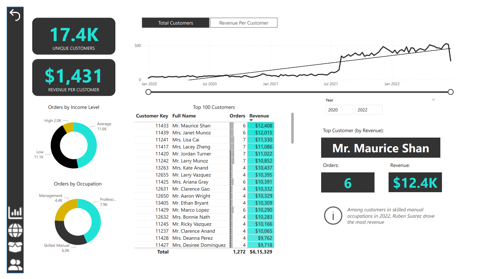

# AdventureWorks Power BI Sales & Performance Report

## Overview
This Power BI report provides a comprehensive analysis of AdventureWorks’ sales performance, profitability, customer behavior, and regional trends. It is designed to support data-driven decision-making by presenting key business KPIs, interactive visuals, and actionable insights.

## Images

## Key Highlights
- **Total Revenue:** $24.9M
- **Total Profit:** $10.5M
- **Total Orders:** 25.2K
- **Return Rate:** 2.17%

## Features
- **Sales & Profit Analysis:** Monthly trends for revenue, orders, profit, and returns from 2020–2022.
- **Product Insights:** Top-performing products, most ordered categories, and highest return-rate products.
- **Target Comparison:** Monthly orders, revenue, and profit compared against predefined targets.
- **Geographical Analysis:** Regional sales distribution across North America, Europe, and the Pacific.
- **Customer Analytics:** Customer segmentation by income and occupation, top customers by revenue, and revenue per customer metrics.
- **What-If Analysis:** Dynamic price adjustment simulation to analyze its impact on profit and returns.

## Tools & Technologies
- **Power BI Desktop**
- **DAX Measures & Calculated Columns**
- **Interactive Visuals & Slicers**

## Use Cases
- Business performance monitoring
- Sales and profitability analysis
- Customer and product segmentation
- Strategic planning and decision support

## How to Use
1. Open the report in Power BI Desktop.
2. Use filters and slicers to explore data by time period, region, product, and customer segment.
3. Analyze KPIs, trends, and insights to support business decisions.

## Dataset
The report is based on the **AdventureWorks** dataset, a commonly used sample database for sales and analytics scenarios.

## Author
**Abhishek Gangurde**

---
*This project demonstrates practical expertise in Power BI, data modeling, DAX, and business analytics.*

